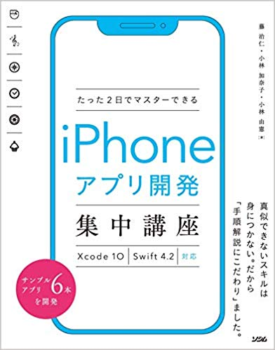

# たった2日でマスターできるiPhoneアプリ開発集中講座 Xcode 10 Swift 4.2対応のマップアプリサンプルコード

## はじめに

[たった2日でマスターできるiPhoneアプリ開発集中講座 Xcode 10 Swift 4.2対応](https://amzn.to/2I896He) に掲載されているサンプルコードマップアプリについて、Xcode 10.2.1(10E1001)で作成したプロジェクトデータ一式です。

## 内容

マップアプリをXcode 10.2.1(10E1001)で新規作成しています。ソースコードには変更ありません。
動作確認は、iPhoneX(iOS12.2インストール済み)で確認しています。

## 書籍の紹介

[たった2日でマスターできるiPhoneアプリ開発集中講座 Xcode 10 Swift 4.2対応](https://amzn.to/2I896He) は、 **初心者の方もサンプルアプリを作ることにより、動く体験と基本の知識が身につくように** Xcodeの操作方法を中心にサンプルプログラムを作ることにより操作に慣れてアプリ開発の基礎を作ります。  
その後は、プログラミング文法書などの他の書籍にステップアップするためのはじめの一歩となることを願っています。

